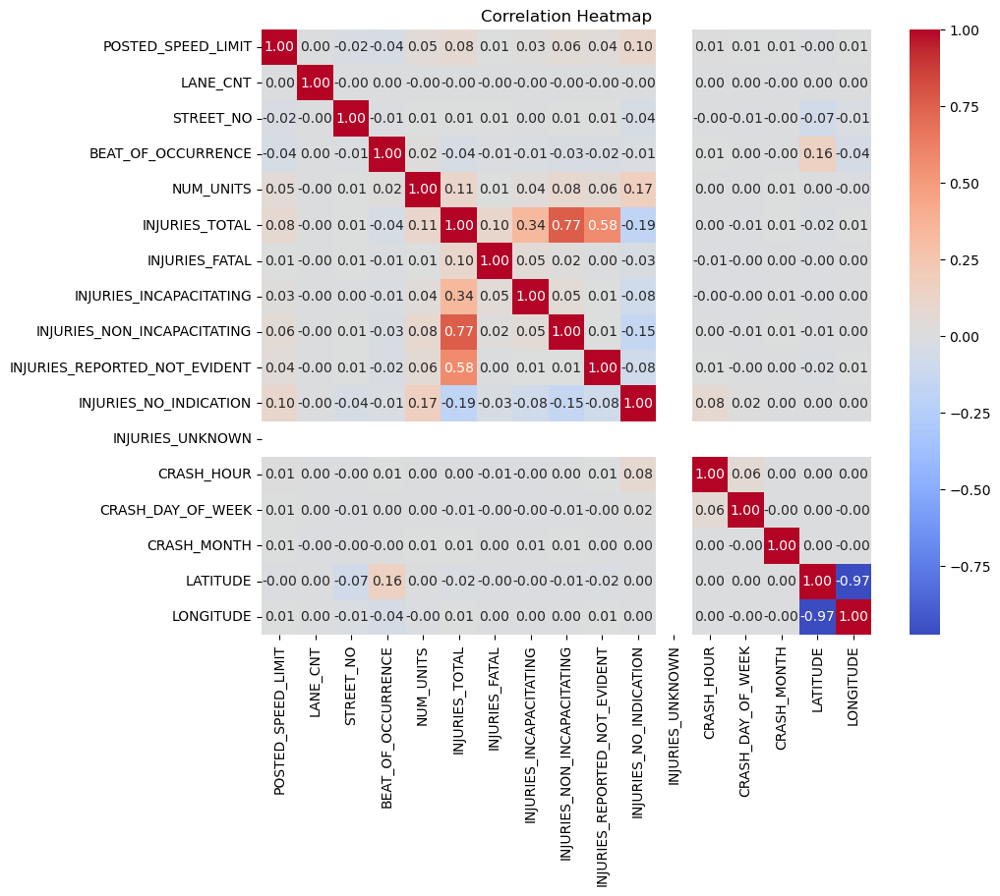
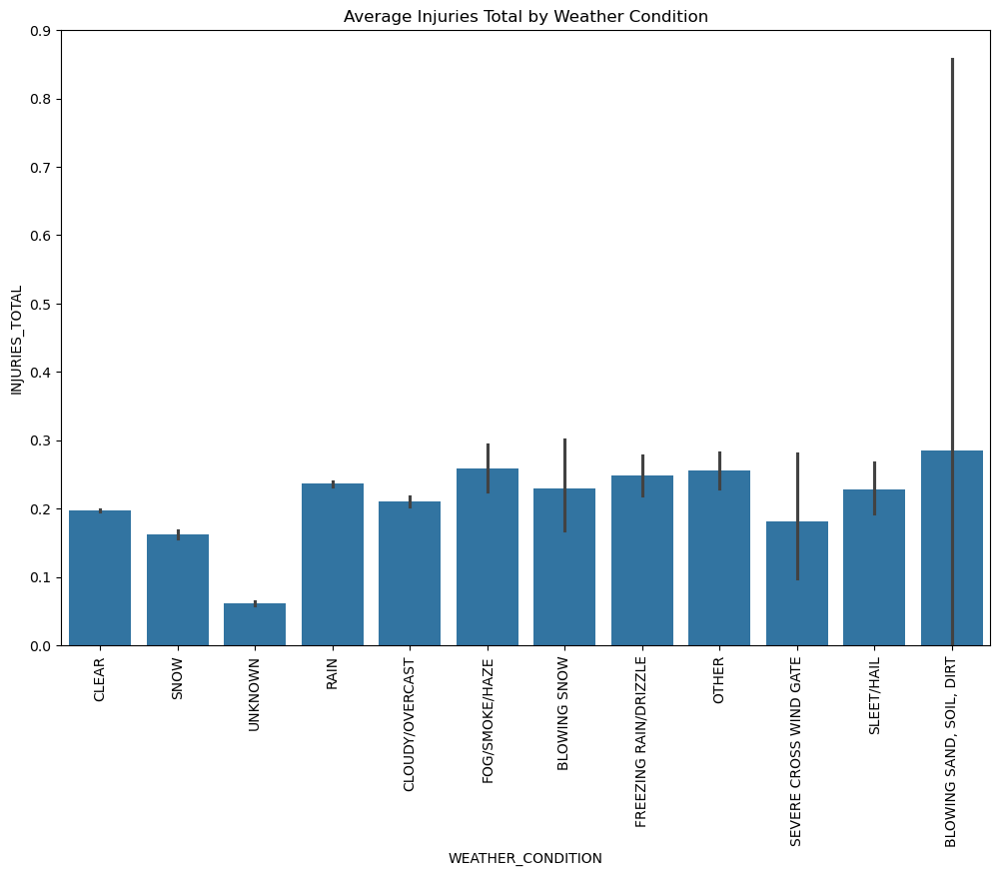
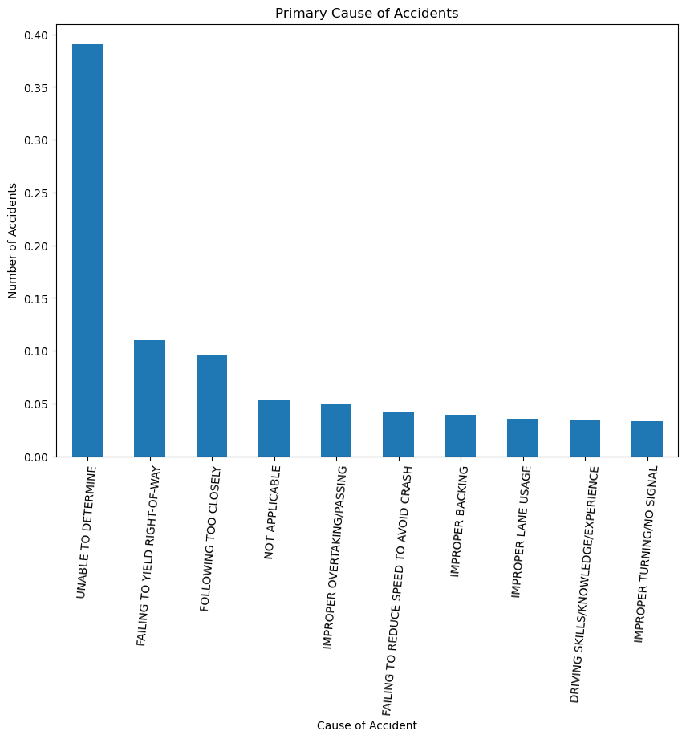
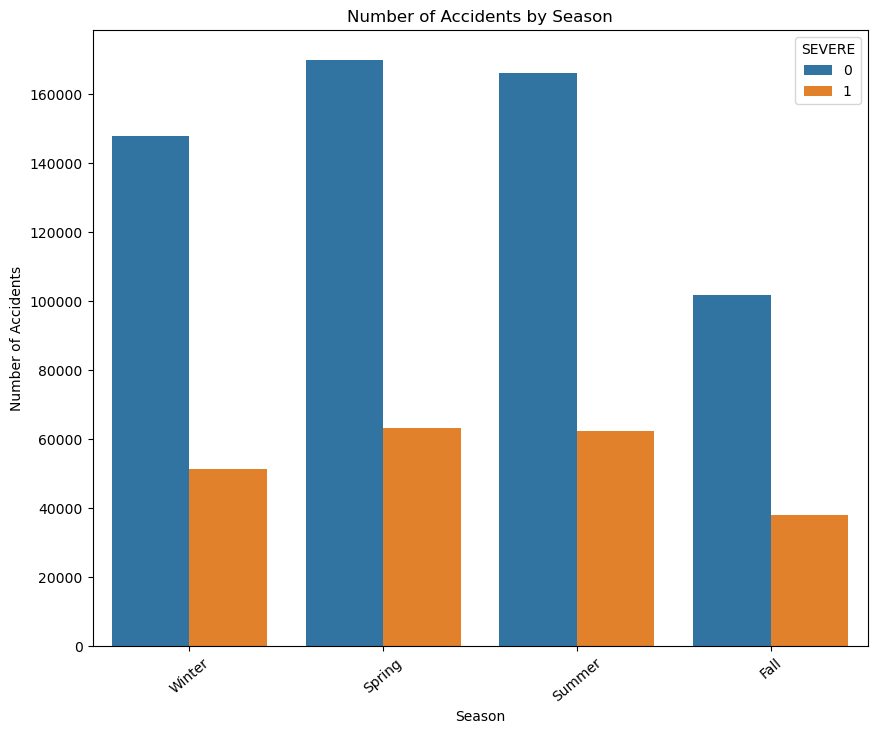
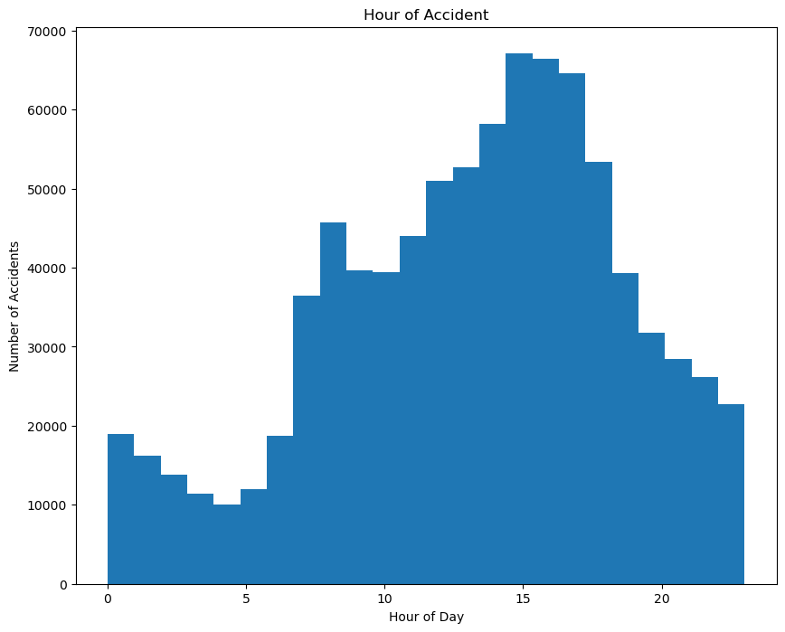
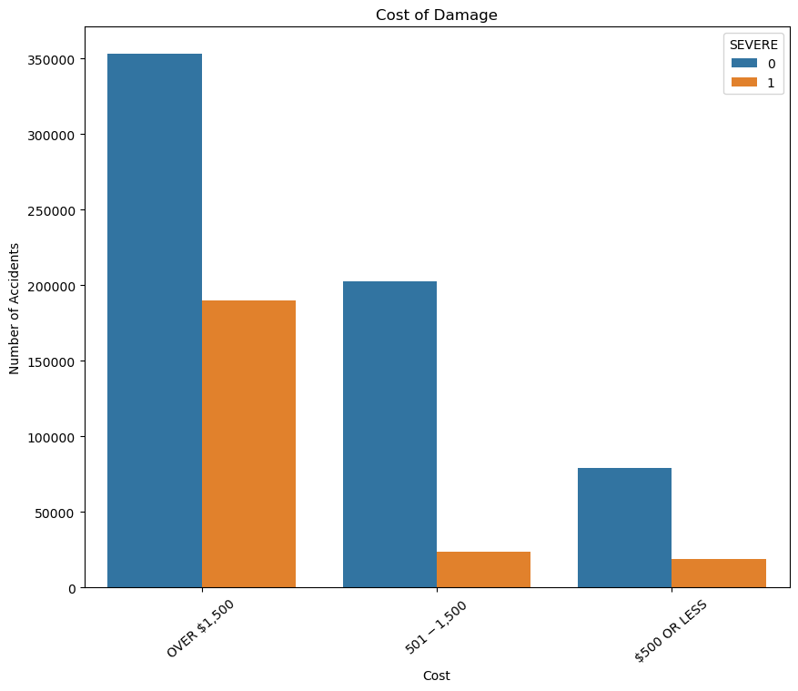

# ChicagoCarCrashes

## Table of Contents
1. [Chicago Car Crashes Predictions](#chicago-car-crashes-predictions)
2. [Author](#author-samwel-waithaka-august-2024)
3. [Overview](#overview)
4. [Business Problem](#business-problem)
5. [Data Understanding](#data-understanding)
6. [Data Preparation](#data-preparation)
7. [Modeling](#modeling)
8. [Results](#results)
9. [Conclusion](#conclusion)
10. [Recommendations](#recommendations)
11. [Possible Next Steps](#possible-next-steps)

## Chicago Car Crashes Predictions

### Author: Samwel Waithaka, August 2024

## Overview

Build a model to predict the severity of traffic crashes based on the Chicago Police Department crash dataset.

## Business Problem

The City of Chicago faces a persistent challenge with traffic accidents, which result in numerous injuries, fatalities, and financial losses each year. The complexity of these incidents, driven by a wide array of factors including road conditions, makes it difficult for authorities to accurately identify the root causes and implement effective prevention strategies. This project seeks to address this issue by developing a machine learning model that can predict the primary contributory cause of car accidents. By analyzing the environmental conditions at the time of the accidents, the model aims to uncover patterns and insights that can inform policy decisions. The ultimate goal is to equip the Vehicle Safety Board and City of Chicago officials with actionable information to reduce the occurrence and severity of traffic accidents, enhancing public safety and optimizing resource allocation for traffic management and accident prevention initiatives.

## Data Understanding

Using the data from the "Chicago Car Crash Dataset," which has more than 800,000 records. The dataset includes details such as the date and time of the accident, location, cause, and more.  
The dataset can be found here: [Chicago Car Crash Dataset](https://data.cityofchicago.org/Transportation/Traffic-Crashes-Crashes/85ca-t3if).

**Columns of the dataset represent:**

- **CRASH_RECORD_ID**: A unique ID that can be used to link to the same crash in the Vehicles and People datasets.
- **RD_NO**: Chicago Police Department report number.
- **CRASH_DATE_EST_I**: Crash date estimated by the desk officer or reporting party.
- **CRASH_DATE**: Date and time of crash.
- **POSTED_SPEED_LIMIT**: Posted speed limit.
- **TRAFFIC_CONTROL_DEVICE**: Traffic control device present at the crash location.
- **DEVICE_CONDITION**: Condition of the traffic control device.
- **WEATHER_CONDITION**: Weather condition at the time of the crash.
- **LIGHTING_CONDITION**: Light condition at the time of the crash.
- **FIRST_CRASH_TYPE**: Type of first collision in the crash.
- **TRAFFICWAY_TYPE**: Trafficway type.
- **LANE_CNT**: Total number of through lanes in either direction, excluding turn lanes.
- **ALIGNMENT**: Street alignment at the crash location.
- **ROADWAY_SURFACE_COND**: Road surface condition.
- **ROAD_DEFECT**: Road defects.
- **REPORT_TYPE**: Administrative report type (at scene, at desk, amended).
- **CRASH_TYPE**: A general severity classification for the crash. Can be either "Injury and/or Tow Due to Crash" or "No Injury / Drive Away."
- **INTERSECTION_RELATED_I**: A field observation by the police officer whether an intersection played a role in the crash.
- **NOT_RIGHT_OF_WAY_I**: Whether the crash began or first contact was made outside of the public right-of-way.
- **HIT_AND_RUN_I**: Whether the crash involved a driver who caused the crash and fled the scene without exchanging information and/or rendering aid.
- **DAMAGE**: A field observation of estimated damage.
- **DATE_POLICE_NOTIFIED**: Calendar date on which police were notified of the crash.
- **PRIM_CONTRIBUTORY_CAUSE**: The factor that was most significant in causing the crash.
- **SEC_CONTRIBUTORY_CAUSE**: The factor that was second most significant in causing the crash.
- **STREET_NO**: Street address number of the crash location.
- **STREET_DIRECTION**: Street address direction (N, E, S, W) of the crash location.
- **STREET_NAME**: Street address name of the crash location.
- **BEAT_OF_OCCURRENCE**: Chicago Police Department Beat ID.
- **PHOTOS_TAKEN_I**: Whether the Chicago Police Department took photos at the location of the crash.
- **STATEMENTS_TAKEN_I**: Whether statements were taken from unit(s) involved in the crash.
- **DOORING_I**: Whether the crash involved a motor vehicle occupant opening a door into the travel path of a bicyclist, causing a crash.
- **WORK_ZONE_I**: Whether the crash occurred in an active work zone.
- **WORK_ZONE_TYPE**: The type of work zone.
- **WORKERS_PRESENT_I**: Whether construction workers were present in an active work zone at the crash location.
- **NUM_UNITS**: Number of units involved in the crash.
- **MOST_SEVERE_INJURY**: Most severe injury sustained by any person involved in the crash.
- **INJURIES_TOTAL**: Total persons sustaining fatal, incapacitating, non-incapacitating, and possible injuries.
- **INJURIES_FATAL**: Total persons sustaining fatal injuries in the crash.
- **INJURIES_INCAPACITATING**: Total persons sustaining incapacitating/serious injuries in the crash.
- **INJURIES_NON_INCAPACITATING**: Total persons sustaining non-incapacitating injuries in the crash.
- **INJURIES_REPORTED_NOT_EVIDENT**: Total persons sustaining possible injuries in the crash.
- **INJURIES_NO_INDICATION**: Total persons sustaining no injuries in the crash.
- **INJURIES_UNKNOWN**: Total persons for whom injuries sustained, if any, are unknown.
- **CRASH_HOUR**: The hour of the day component of CRASH_DATE.
- **CRASH_DAY_OF_WEEK**: The day of the week component of CRASH_DATE. Sunday=1.
- **CRASH_MONTH**: The month component of CRASH_DATE.
- **LATITUDE**: The latitude of the crash location.
- **LONGITUDE**: The longitude of the crash location.
- **LOCATION**: The crash location.

## Data Preparation

During data preparation, the following steps were taken:

-Handling Missing Values: Missing values were addressed using imputation methods, or the columns were dropped if deemed irrelevant to the analysis.

-Feature Engineering: New features were created based on domain knowledge.

-Data Splitting: The data was split into training and testing sets to evaluate model performance.

### Feature Engineering

Visualization of the data using Seaborn and Matplotlib.

**Below is a bar plot of the top 10 primary causes of the crash:**  
The plot shows that most accidents are unable to be determined, followed by failure to yield to the right of way.

**A counter plot of the number of severe and non-severe accidents in different seasons:**

It is observed that most severe and non-severe accidents occurred during the summer.

**Histogram of the crash hour:**  
To check the number of accidents in that hour. Most accidents occur during the morning and evening rush hours.

**Counter plot of Damage cost:**  
Most severe and non-severe accident damage costs are more than $1500.

## Modeling

Several models were performed on the data. A Logistic Regression model was run as a baseline model. SMOTE was used to handle class imbalance. Other models like K Nearest Neighbors, Decision Tree, Random Forest, and Grid Search with different models, as well as a Pipeline with StandardScaler and Logistic Regression, were tried. The Logistic Regression model was chosen as the final model. The table below shows the scores of F1 train, F1 test, and accuracy of all models performed.

## Results

| Model                        | Train F1 | Test F1 | Accuracy |
|------------------------------|:--------:|:-------:|:--------:|
| Logistic Regression          | 0.75     | 0.75    | 0.90     |
| Logistic Regression (SMOTE)  | 0.87     | 0.74    | 0.89     |
| Decision Tree                | 1.0      | 0.69    | 0.85     |
| Decision Tree (SMOTE)        | 1.0      | 0.68    | 0.88     |
| Decision Tree with GridSearch| 0.86     | 0.70    | 0.86     |
| Random Forest                | 0.75     | 0.76    | 0.89     |
| Random Forest (SMOTE)        | 0.80     | 0.74    | 0.83     |
| Random Forest with GridSearch| 0.74     | 0.74    | 0.87     |
| Pipeline Logistic            | 0.76     | 0.76    | 0.90     |

## Conclusion

Final models show that certain columns have a greater effect on the severity of a car accident than others.  
Accidents involving pedestrians are more likely to result in severe injury.  

Some other factors such as drivers who fail to yield the right of way, weather conditions, and road defects also lead to accidents with a severity that requires attention. 

## Recommendations

1. **Accident prevention campaigns**: Educating the public on safe driving behaviors, particularly around yielding to pedestrians and complying with traffic control devices.
2. **Improving road conditions**: Addressing and improving conditions in areas where poor roadway surfaces or defects have been identified.
3. **Advanced traffic management systems**: Installing sensors and signals to alert drivers of upcoming traffic jams, especially during peak hours.
4. **Improved law enforcement**: Increased enforcement of traffic laws and road safety measures, particularly in high-risk areas.

## Possible Next Steps

- Incorporate more features to improve the model's predictive power.
- Use additional data sources to validate model accuracy.
- Develop a live dashboard for monitoring and predicting crash occurrences.
- Collaborate with city planners to use the model's results for real-world applications.  
